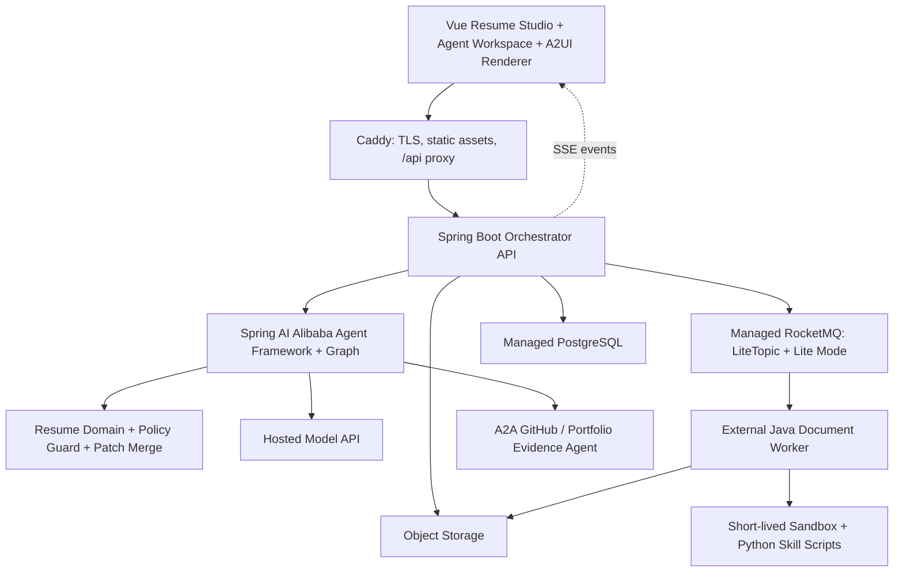

# Tsumi Resume AI Agent Workbench Design

Date: 2026-07-13

Status: Approved design

Target: Competition, interview, and open-source showcase MVP
Source project reviewed: [`kakerusan/tsumi_resume`](https://github.com/kakerusan/tsumi_resume), commit `596cf29`

## 1. Capability

Tsumi Resume becomes an evidence-first AI resume workbench. A candidate can upload a PDF or DOCX resume, provide a job description, receive traceable wording and structure improvements from a controlled multi-agent workflow, review every change in a code-review-style interface, and export a verified resume. The system may rewrite facts already supported by approved sources, but it must never invent, imply, quantify, or insert unsupported claims.

The MVP optimizes for a compelling, technically credible demonstration rather than a complete commercial SaaS product. It must make agent execution, evidence, human approval, asynchronous processing, failure recovery, and evaluation visible.

## 2. Current Project Context

The reviewed project is a Vue 3.5 and Vite 8 local-first resume builder. It currently provides:

- left-side editing and real-time A4 preview;
- a normalized JSON resume model through `normalizeResumeData()`;
- IndexedDB storage with localStorage fallback;
- JSON import and export;
- PDF export through browser printing;
- PNG export through SVG and Canvas;
- no backend, authentication, test suite, or server-side task system.

The normalized resume JSON is the correct migration seam. It will become a versioned Resume AST contract shared by the Vue application and Java backend. The existing editor and preview remain the primary editing surface.

The current production environment is a 2-core, 2-GB server with Caddy serving static assets. The design keeps that server as a lightweight entry and control plane and uses externally hosted capabilities for stateful or resource-intensive work.

## 3. Goals

1. Support PDF and DOCX resume input plus pasted job descriptions in the competition MVP.
2. Produce only evidence-backed, path-level resume patches.
3. Require human approval before any patch becomes a new resume version.
4. Show original and proposed text, rationale, evidence, job-description alignment, risk, and review status.
5. Demonstrate controlled multi-agent orchestration with observable execution and explicit stopping rules.
6. Use A2UI for safe declarative review surfaces and A2A for independently deployed evidence agents.
7. Use RocketMQ LiteTopic for task/session event isolation and asynchronous workers.
8. Execute untrusted document and rendering work in short-lived sandboxes.
9. Publish repeatable evaluations, including failures, latency, token use, and task cost.
10. Preserve the existing local editor while adding server-backed version history and review.

## 4. Non-goals

- Automatic job applications or browser automation.
- Inventing or suggesting unsupported experience, metrics, skills, titles, awards, dates, employers, or causal claims.
- Placeholder claims such as `__%`, `X times`, or “add a metric here.”
- Training or self-hosting a foundation model.
- Running PostgreSQL, RocketMQ, Chromium, document parsers, or model inference on the 2C2G host.
- Sending all internal agent calls through A2A.
- Allowing agents to have unbounded free-form conversations.
- Claiming to reproduce every proprietary applicant-tracking system.
- Full billing, organization management, or enterprise tenancy in the competition MVP.

## 5. System Invariants

### 5.1 Evidence before edit

- A mergeable patch must have one or more valid `evidenceRefs`.
- Every atomic claim in `after` must be entailed by approved evidence.
- Model confidence is never evidence.
- Empty evidence, incomplete evidence coverage, or a newly introduced atomic claim causes deterministic rejection.
- Missing information may appear only in a separate diagnostic area as a neutral coverage gap. It has no proposed content and no accept action.
- External GitHub or portfolio evidence must be reviewed and accepted as a source before it may support a resume patch.

Allowed patch intents are:

- `PARAPHRASE`
- `RESTRUCTURE`
- `COMPRESS`
- `DELETE`
- `EXTRACT_SUPPORTED_KEYWORD`

The domain schema does not expose `NEW_FACT`, `ADD_EVIDENCE`, speculative metric, or placeholder operations.

### 5.2 Human approval

- Agents create proposals, never committed resume versions.
- Users may accept, reject, or edit each patch.
- A patch is merged only after explicit approval.
- A merge checks `baseVersion`; stale patches cannot overwrite newer edits.
- Every approved merge creates an immutable new version and remains reversible.

### 5.3 Controlled agency

- The orchestrator owns the workflow DAG, tool availability, concurrency, token budget, retry count, approval gates, and stop conditions.
- An agent may perform at most one directed self-repair for a failed review in the MVP.
- High-risk operations are exposed as narrow tools with typed inputs and outputs.
- Agent and tool observations return status, summary, next actions, and artifact identifiers.

## 6. Architecture



### 6.1 Experience layer

The Vue application keeps the current editor and preview and adds:

- Agent Workspace for job description input, optimization goals, task state, cancel, and retry;
- A2UI Review for path-level diffs and review actions;
- Evidence Drawer for source excerpts, origin, confidence, and risk;
- task timeline with agent, tool, latency, model, token, and cost events;
- before/after transparent job-description coverage report;
- server-backed version history and rollback.

### 6.2 Control plane

A single Spring Boot process runs on the 2C2G host for the MVP. It provides:

- REST endpoints and SSE streams;
- task lifecycle and checkpoints;
- Spring AI Alibaba workflow invocation;
- typed agent tools;
- Resume AST normalization;
- Policy Guard enforcement;
- patch review and merge;
- persistence, object storage, and RocketMQ adapters;
- concurrency, memory, rate, and cost limits.

`×1` means one deployed API process, not one user or one agent. Resource-heavy work does not execute in this process. Durable task state lives outside the process, so a restart can recover unfinished tasks.

### 6.3 Execution plane

External Java workers consume document and render jobs. Python is not a permanent backend service. Python exists only in Skill `scripts/` for deterministic operations such as:

- extracting PDF or DOCX text and structure;
- inspecting page count, overflow, fonts, and layout;
- extracting repository statistics from an approved local snapshot;
- normalizing parser output to a declared JSON Schema.

Scripts run under a sandbox wrapper and receive only explicit input artifacts. They do not receive database, RocketMQ, object-storage, or model credentials.

## 7. Workflow

### 7.1 Task states

```text
CREATED
  -> PARSING
  -> ANALYZING
  -> PROPOSING
  -> VERIFYING
  -> REVIEW_READY
  -> APPROVED
  -> RENDERING
  -> COMPLETED

Any active state -> FAILED | CANCELLED
VERIFYING -> PROPOSING only for one directed repair
```

Every state transition is validated by the domain layer and saved as a checkpoint. Workers are idempotent by `(taskId, stage, attempt)`.

### 7.2 Main task flow

1. The user uploads a PDF or DOCX, pastes a job description, and selects an optimization goal.
2. The API validates file metadata and stores the original in isolated object storage.
3. A document worker parses the file in a sandbox and produces a Resume AST plus a parser report.
4. Low-confidence fields are shown to the user for confirmation before optimization.
5. JD Analyst produces a structured role capability matrix with source spans.
6. Baseline reviewers compute transparent job-description coverage, language, evidence, and layout reports.
7. Rewrite Agent proposes `ResumePatch` records using approved evidence only.
8. Evidence Guard, language reviewer, job-description reviewer, and layout reviewer run in controlled parallel branches.
9. A failed proposal receives at most one directed rewrite. A second failure is reported rather than hidden.
10. The API publishes a Review Surface through A2UI.
11. The user accepts, rejects, or edits individual patches.
12. The server validates `baseVersion` and policy again, then creates a new immutable Resume version.
13. A render worker generates and inspects the PDF in a sandbox.
14. The UI presents artifacts, provenance, coverage changes, runtime, token use, cost, and any residual warnings.

## 8. Domain Contracts

### 8.1 Resume AST

The current normalized JSON uses `meta.schemaVersion = 12`. The shared server envelope advances this to schema version 13, moves the version marker to the envelope, and retains stable identifiers on repeatable entities so patches do not depend on array positions alone.

Required envelope fields:

```json
{
  "resumeId": "res_01",
  "version": 12,
  "schemaVersion": 13,
  "profile": {},
  "educations": [],
  "internships": [],
  "projects": [],
  "studentExperiences": [],
  "researchExperiences": [],
  "customImages": [],
  "skills": "",
  "awards": [],
  "certificates": [],
  "selfSummary": {},
  "layout": {},
  "theme": {}
}
```

Client and server normalizers must pass the same contract fixtures before the backend becomes authoritative.

### 8.2 ResumePatch

```json
{
  "patchId": "rp_018",
  "taskId": "task_01",
  "resumeId": "res_01",
  "baseVersion": 12,
  "op": "replace",
  "path": "/projects/p_01/highlights/h_02",
  "before": "负责开发在线简历项目，实现了简历编辑和导出功能。",
  "after": "基于 Vue 3 与 Vite 构建本地优先的中文技术简历编辑器，打通结构化编辑、实时 A4 预览及 PDF/PNG 导出链路。",
  "intent": "PARAPHRASE",
  "evidenceRefs": ["resume:projects/p_01", "repo:README#features"],
  "jdRefs": ["jd:skill/vue", "jd:delivery/export"],
  "evidenceCoverage": 1.0,
  "newAtomicClaims": [],
  "confidence": 0.92,
  "riskFlags": [],
  "policyDecision": "ALLOW",
  "reviewStatus": "PENDING"
}
```

The server independently recomputes evidence coverage and policy decisions. LLM-provided policy fields are advisory and cannot authorize a merge.

### 8.3 Evidence Artifact

An evidence artifact contains:

- stable artifact and source identifiers;
- source type and retrieval time;
- exact excerpt or structured fact;
- content hash;
- provenance and authorization scope;
- user approval status;
- expiration or revocation state.

Only approved, unexpired evidence is eligible for patch validation.

## 9. A2UI Review Contract

The system uses three layers:

1. `ResumePatch` is the domain truth and is independent of UI protocols.
2. `ReviewSurface` groups validated patches, evidence, diagnostics, and allowed actions.
3. An A2UI adapter converts `ReviewSurface` into the pinned production protocol version.

The initial implementation targets A2UI v0.9.1. The adapter boundary allows later protocol upgrades without changing resume or patch contracts.

The Vue renderer exposes a whitelist catalog:

- `DiffCard`
- `EvidenceList`
- `RiskBadge`
- `CoverageGap`
- `ReviewActions`
- `TaskTimeline`
- `CostSummary`

The agent never sends HTML or JavaScript. The server validates component names, data bindings, action identifiers, payload size, and nesting depth before streaming a Surface. Review actions are sent back as typed commands and re-authorized by the server.

## 10. Multi-agent Design

Internal agents are workflow roles inside one trust domain. They use typed Java tools rather than A2A:

- JD Analyst: job-description spans to capability matrix;
- Rewrite Agent: approved evidence to ResumePatch candidates;
- Evidence Guard: atomic-claim coverage and unsupported-claim rejection;
- Language Reviewer: clarity, redundancy, tense, and terminology;
- JD Reviewer: transparent requirement coverage, not proprietary ATS simulation;
- Layout Reviewer: page overflow, section priority, and render warnings.

The initial graph is deterministic:

```text
parse
  -> confirm uncertain fields
  -> analyze JD
  -> baseline review
  -> propose patches
  -> parallel(evidence, language, JD, layout)
  -> optional single repair
  -> human review
  -> merge
  -> render and inspect
```

Spring AI Alibaba Agent Skills provide progressive disclosure. The system prompt receives Skill name, description, and path only. An agent loads full instructions through `read_skill` when the workflow makes that Skill available.

## 11. Skill Contract

Each Skill follows this structure:

```text
skill-name/
├── SKILL.md
├── references/
├── examples/
└── scripts/
```

Skill scripts obey these rules:

- JSON input and output validated against a versioned schema;
- deterministic behavior for identical inputs and tool versions;
- no direct network access unless a specific Skill is separately approved;
- no shell composition from model-generated strings;
- fixed command allowlist and argument schema;
- CPU, memory, process, file-count, expanded-size, and wall-time limits;
- structured result with `status`, `summary`, `nextActions`, and `artifacts`;
- root-cause hint and safe retry guidance for failures.

Initial Skills:

- `parse-resume`
- `inspect-layout`
- `collect-repo-evidence`

`collect-repo-evidence` operates on a user-approved repository snapshot. Its result becomes a pending Evidence Artifact, not an automatic resume edit.

## 12. A2A Boundary

A2A is reserved for independently deployed agents with separate ownership, language, runtime, or scaling:

- GitHub Evidence Agent;
- Portfolio Evidence Agent;
- later credential or third-party review agents.

An external agent publishes an Agent Card. The orchestrator exchanges tasks and structured artifacts, with authentication, authorization, source allowlists, timeouts, size limits, and cancellation. External agents do not receive the internal Resume object unless the task explicitly requires an approved subset.

Internal specialist agents do not use A2A. This avoids unnecessary serialization, network failure modes, and protocol coupling.

## 13. RocketMQ LiteTopic Design

The official product concepts are LiteTopic and Lite Mode lightweight subscription. The application exposes an internal `EventBus` interface so domain code is not coupled to a specific managed provider.

Topic layout:

```text
task/{taskId}       ordered workflow and UI events
render/{jobId}      parser and render job events
session/{sessionId} resumable browser delivery events
```

Properties:

- one lightweight, ordered channel per task or session;
- automatic creation and TTL-based cleanup where supported;
- idempotent consumers;
- exponential backoff with a fixed attempt limit;
- dead-letter handling with operator-visible replay;
- correlation, causation, schema version, producer, timestamp, and trace identifiers on every event;
- SSE resumes from the last acknowledged event identifier.

RocketMQ transports events and jobs. It does not store the authoritative task state and does not perform agent reasoning.

## 14. Sandbox and File Security

Untrusted documents are never parsed in the Orchestrator API process.

Pipeline:

1. Validate extension, MIME type, magic bytes, size, and declared content type.
2. Store under a random object key with quarantine status.
3. Start a short-lived, non-root container with a read-only root filesystem and tmpfs workspace.
4. Use no host mounts, Docker socket, production source directory, or long-lived credentials.
5. Disable network by default.
6. Apply CPU, memory, process, time, page-count, expanded-size, image-pixel, and output-size limits.
7. Permit only declared JSON, PDF, and PNG outputs.
8. Validate output, upload it with provenance, and destroy the whole container.

Render images are pinned by digest and include fixed browser, parser, and font versions. This makes output reproducible and makes dependency upgrades reviewable.

## 15. Privacy and Data Lifecycle

- Names, phone numbers, email addresses, photos, and physical addresses are removed or replaced with stable placeholders before model calls unless a task explicitly needs them.
- Model adapters send the minimum required resume sections.
- Production model accounts must use available no-training and minimum-retention controls.
- Object storage uses short-lived signed URLs.
- Resume versions are immutable and record actor, time, base version, patches, and evidence.
- Original uploads, generated artifacts, traces, and business versions have separate retention policies.
- Public deployment requires a visible delete-all-data operation.
- Logs do not include raw resume text, credentials, signed URLs, or model prompts containing PII.

Exact public retention periods and the selected managed providers are deployment-policy decisions. Local and judge-demo modes use ephemeral data and delete uploaded originals and sandbox artifacts when the demo session ends.

## 16. Deployment Topology

### 16.1 Existing 2C2G host

- Caddy: TLS, compression, static Vue files, `/api` reverse proxy, request-size limits, and coarse rate limits.
- Vue SPA.
- One Spring Boot Orchestrator API process with explicit heap and concurrency limits.
- Short-term cache and structured operational logs only.

The host does not run PostgreSQL, RocketMQ, document parsing, Chromium, or model inference.

### 16.2 External managed plane

- hosted model API;
- managed PostgreSQL;
- object storage;
- managed RocketMQ with LiteTopic capability;
- external Java document workers;
- short-lived sandbox execution capacity;
- optional external A2A evidence agents.

Provider-specific clients live behind Java ports. The domain and workflow modules depend only on internal interfaces.

## 17. Repository Layout

```text
tsumi-resume/
├── apps/
│   ├── web/
│   └── server/
├── modules/
│   ├── resume-domain/
│   ├── agent-workflow/
│   ├── task-runtime/
│   ├── a2ui-adapter/
│   ├── a2a-adapter/
│   └── infrastructure/
├── workers/
│   └── document-worker/
├── skills/
│   ├── parse-resume/
│   ├── inspect-layout/
│   └── collect-repo-evidence/
├── contracts/
├── evals/
├── infra/
└── docs/
```

`apps/server` is the only API deployable on the 2C2G host. Java modules are separately testable libraries. `document-worker` is a separate deployable that imports shared contracts and Skill execution infrastructure.

## 18. API and Event Surfaces

Minimum API surface:

```text
POST   /api/v1/uploads
POST   /api/v1/tasks
GET    /api/v1/tasks/{taskId}
GET    /api/v1/tasks/{taskId}/events
POST   /api/v1/tasks/{taskId}/cancel
POST   /api/v1/tasks/{taskId}/retry
GET    /api/v1/tasks/{taskId}/review-surface
POST   /api/v1/tasks/{taskId}/patches/{patchId}/decision
POST   /api/v1/tasks/{taskId}/merge
GET    /api/v1/resumes/{resumeId}/versions
POST   /api/v1/resumes/{resumeId}/versions/{version}/render
```

Every mutation accepts an idempotency key. Review and merge commands include the expected base version. Error responses include a stable code, summary, root-cause hint where safe, retryability, and next action.

## 19. Failure and Recovery

- Every stage persists its input artifact IDs, output artifact IDs, status, attempt, and trace ID.
- API restarts recover active tasks from PostgreSQL and event offsets.
- Worker retries use exponential backoff and a fixed maximum.
- Non-retryable validation and policy failures stop immediately.
- Exhausted jobs enter a dead-letter flow and become visible to an operator or judge.
- Browser reconnects resume SSE from `Last-Event-ID`.
- Model timeouts can retry once with the same structured request; policy decisions are always recomputed.
- A stale patch returns a version-conflict response and must be regenerated or manually rebased.
- Cancellation propagates to pending workers and prevents later merge or render actions.

## 20. Test and Evaluation Strategy

### 20.1 Deterministic tests

- Unit: Resume normalization, JSON Schema, patch apply/revert, evidence policy, atomic-claim checks, version conflict, and state transitions.
- Contract: A2UI messages, A2A artifacts, LiteTopic events, Skill schemas, and REST errors.
- Workflow: fixed fake-model recordings for success, timeout, policy rejection, repair, cancellation, and restart recovery.
- Security: malicious PDF/DOCX, prompt injection in documents, zip bombs, oversized images, path traversal, SSRF attempts, and output escape.
- End-to-end: upload, parse confirmation, review, merge, render, disconnect, reconnect, version race, and rollback.

### 20.2 Model evaluations

The repository includes versioned, consent-safe fixtures with gold evidence and expected constraints. Evaluations report:

- unsupported atomic facts;
- evidence precision and coverage;
- patch semantic equivalence;
- language-quality rubric;
- transparent JD requirement coverage;
- user accept, edit, and reject rates;
- workflow completion and retry rates;
- first Review Surface latency and total latency;
- tokens and estimated cost per completed task.

Evaluation output includes failed examples. It must not report only a blended score.

## 21. Acceptance Criteria

The competition MVP is complete when:

1. A PDF or DOCX and a pasted job description can complete the full review and export flow.
2. The curated evaluation set contains zero unsupported atomic facts in mergeable patches.
3. Every mergeable patch has valid evidence references and full computed evidence coverage.
4. Parser key-field F1 is at least 95% on the published gold fixture set, with results split by format and template.
5. Workflow completion is at least 95% on the published scenario suite; retries and failures remain visible.
6. Human approval is mandatory and stale patch merges are rejected.
7. Sandbox tests demonstrate blocked network, host access, resource abuse, and invalid outputs.
8. SSE reconnect resumes a running task without restarting model or worker work.
9. The demo displays agent stages, evidence, tool artifacts, latency, tokens, cost, and failure recovery.
10. The project documents architecture, threat model, ADRs, local setup, managed deployment, eval methodology, and known limitations.

## 22. Delivery Milestones

### M0 — Contracts and trust foundation

- Version the existing Resume JSON Schema.
- Build shared fixtures for Vue and Java normalization.
- Implement ResumePatch, evidence, policy, state machine, and version-conflict tests.

### M1 — Competition vertical slice

- PDF/DOCX and job-description input.
- Spring AI Alibaba workflow.
- Evidence-backed patches.
- A2UI review and human merge.
- Sandbox render and export.

### M2 — Engineering showcase

- RocketMQ LiteTopic transport.
- External document worker.
- SSE resume, traces, retries, dead-letter replay, cost, and latency UI.

### M3 — A2A evidence extension

- GitHub Evidence Agent and Agent Card.
- Evidence Artifact review and approval.
- No automatic resume write from external evidence.

### M4 — Open-source packaging

- One-command judge demo with safe fixture data.
- Architecture animation and three-minute demo video.
- Threat model, failure catalog, eval report, and benchmark history.
- Contribution guide for new Skills and evidence agents.

## 23. Implementation-time Decisions

These decisions do not change the approved architecture but must be selected in the implementation plan:

- exact Spring Boot and Spring AI Alibaba versions, pinned after compatibility verification;
- initial hosted model and fallback model, both behind a model port;
- managed PostgreSQL, object-storage, RocketMQ, and sandbox providers;
- JSON Schema library and atomic-claim verification implementation;
- public authentication method after the anonymous, signed judge-demo session mode;
- production retention periods and regional data residency.

Defaults for planning are JDK 21, the current stable Spring AI Alibaba release line, DashScope as the first model adapter, anonymous signed demo sessions, and provider-neutral infrastructure ports.

## 24. References

- [Tsumi Resume source project](https://github.com/kakerusan/tsumi_resume)
- [Spring AI Alibaba repository](https://github.com/alibaba/spring-ai-alibaba)
- [Spring AI Alibaba Agent Skills](https://java2ai.com/docs/frameworks/agent-framework/tutorials/skills/)
- [A2UI protocol](https://a2ui.org/)
- [A2A protocol](https://a2aproject.github.io/A2A/latest/)
- [Apache RocketMQ LiteTopic](https://rocketmq.apache.org/docs/domainModel/03litetopic/)
- [RocketMQ AI-native session continuity](https://rocketmq.apache.org/docs/bestPractice/03session/)
